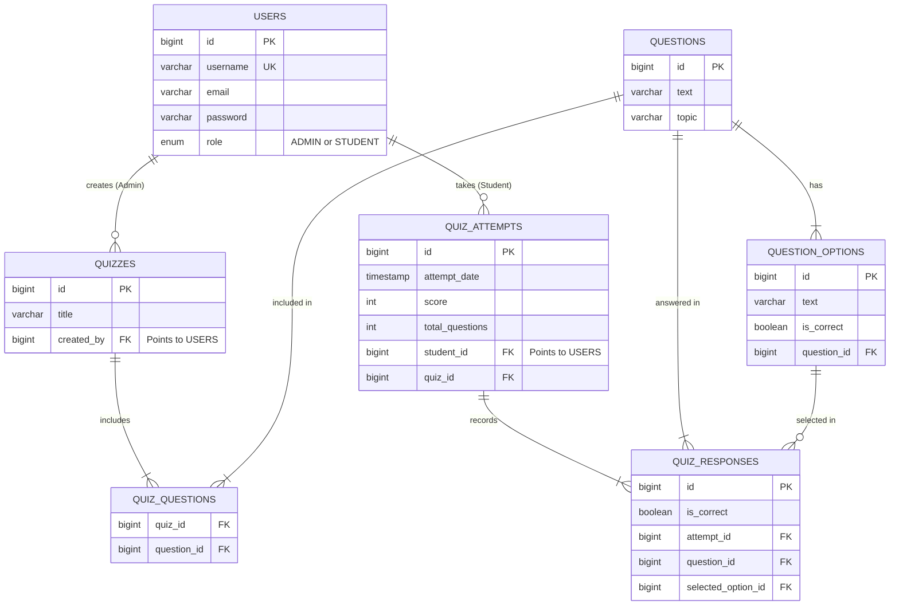

# QuizForge ⚡

QuizForge is a modern, role-based web application for managing and taking technical quizzes. It features a fully decoupled architecture with a sleek vanilla HTML/CSS/JS frontend, a robust Spring Boot REST API backend, and a cloud-hosted Neon PostgreSQL database.

## 🏗 System Architecture

The application is split into two distinct parts: a static frontend and a Java backend. They communicate entirely over REST APIs.

```mermaid
graph TD
    subgraph Frontend [Frontend (Static Web Server)]
        UI[Browser HTML/CSS/JS]
    end

    subgraph Backend [Backend (Spring Boot Server)]
        Controller[REST Controllers]
        Service[Service Layer]
        Repository[JPA Repositories]
    end

    subgraph Cloud [Cloud]
        DB[(Neon PostgreSQL)]
    end

    UI <-->|HTTP JSON Requests| Controller
    Controller <--> Service
    Service <--> Repository
    Repository <-->|JDBC| DB
```

## 🗄 Database ER Diagram

The database is highly relational, utilizing Foreign Keys to link Users, Questions, Quizzes, and Attempts.



## 🚀 Getting Started (Local Development)

To run this project on your local machine, you will need to start both the Frontend and the Backend servers.

### 1. Start the Spring Boot Backend
Requires **Java 17+**.
1. Open a terminal.
2. Navigate to the backend directory:
   ```bash
   cd quizforge-backend
   ```
3. Run the Gradle wrapper:
   ```bash
   ./gradlew bootRun
   ```
*The backend will start on `http://localhost:8080`. It automatically connects to the Neon PostgreSQL database configured in `application.properties`.*

### 2. Start the Frontend Web Server
Requires **Python 3+**.
1. Open a **new** terminal.
2. Navigate to the frontend directory:
   ```bash
   cd quizforge-frontend
   ```
3. Start the static server:
   ```bash
   python3 -m http.server 8000
   ```
*Access the application at `http://localhost:8000`.*

---

## 🌍 Hosting Online (Deployment)

If you want to host this application publicly on the internet for free, follow this guide:

### 1. Database (Already Hosted)
You are currently using **Neon PostgreSQL**, which is a cloud database. No changes are needed! The database is already live.

### 2. Host the Backend (Render.com or Railway.app)
1. Push your `quizforge-backend` folder to a GitHub repository.
2. Create an account on **Render** (https://render.com).
3. Click "New Web Service" and connect your GitHub repo.
4. Render will automatically detect it as a Java Spring Boot/Gradle app.
5. Set the Start Command to: `./gradlew bootRun`
6. Once deployed, Render will give you a live URL (e.g., `https://quizforge-api.onrender.com`).

### 3. Host the Frontend (Vercel or Netlify)
1. Open `quizforge-frontend/js/api.js`.
2. Change `API_BASE_URL` from `http://localhost:8080/api` to your new Render backend URL (`https://quizforge-api.onrender.com/api`).
3. Push your `quizforge-frontend` folder to GitHub.
4. Go to **Vercel** (https://vercel.com) and deploy the repository. 
5. Vercel will instantly host your static HTML/CSS/JS files and give you a clean URL for your students to access!
