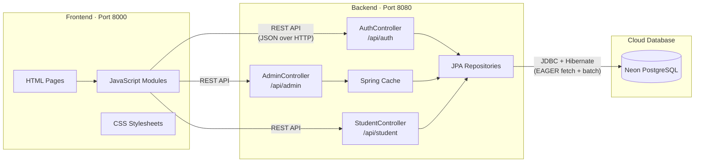
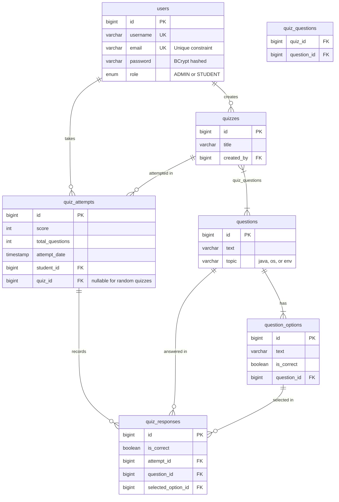

# QuizForge ⚡

A modern, full-stack quiz management platform built with **Spring Boot** and vanilla **HTML/CSS/JS**. QuizForge features role-based access (Admin & Student), a cloud-hosted PostgreSQL database, BCrypt password security, and a sleek dark-mode UI.

---

## ✨ Features

| Role | Capabilities |
|------|-------------|
| **Admin** | Create/delete questions, build custom quizzes from the question bank, view all registered students with per-student stats, view platform-wide statistics |
| **Student** | Browse admin-assigned quizzes, generate random quizzes by topic, take quizzes with instant grading, review correct answers after submission, view personal attempt history & stats |

### Security & Performance
- 🔐 **BCrypt** password hashing — passwords never stored or transmitted in plain text
- 🛡 **Server-side role authorization** — admin endpoints verify the caller's role
- 🚫 **Duplicate attempt blocking** — students cannot re-submit the same quiz
- ✅ **Input validation** — username (≥3 chars), password (≥6 chars), email (regex + unique)
- ⏱ **30-minute session timeout** — auto-logout on inactivity
- ⚡ **Three-layer caching** — Spring `@Cacheable`, localStorage frontend cache, EAGER Hibernate fetching
- 📄 **Paginated question bank** — 20 questions per page to keep the UI snappy

### Quiz Experience
- 🎲 **Random quiz generator** with topic filtering (Java / OS / Environment)
- 📝 **Answer review** — after submission, correct answers are highlighted green (✓), wrong answers red (✗)
- ⚠️ **Unanswered question warning** before submission
- 🔔 **Toast notifications** — animated slide-in toasts replace all `alert()` popups

---

## 🏗 System Architecture



### API Endpoints

| Method | Endpoint | Description |
|--------|----------|-------------|
| `POST` | `/api/auth/register` | Register a new student account (validated) |
| `POST` | `/api/auth/login` | Login (Admin or Student) |
| `GET` | `/api/admin/questions` | List all questions in the bank (cached) |
| `POST` | `/api/admin/questions` | Add a new question with options |
| `DELETE` | `/api/admin/questions/{id}` | Delete a question |
| `GET` | `/api/admin/quizzes` | List all admin-created quizzes (cached) |
| `POST` | `/api/admin/quizzes` | Create a custom quiz from selected questions |
| `GET` | `/api/admin/stats` | Get platform statistics (COUNT queries) |
| `GET` | `/api/admin/students` | List all students with per-student stats |
| `GET` | `/api/student/quizzes` | List quizzes available to students |
| `GET` | `/api/student/quizzes/random` | Generate a random quiz by topics & count |
| `POST` | `/api/student/attempts` | Save a quiz attempt (blocks duplicates) |
| `GET` | `/api/student/attempts/{studentId}` | Get a student's quiz history |

---

## 🗄 Database ER Diagram



---

## 📁 Project Structure

```
QuizForge/
├── README.md
├── quizforge-backend/                  # Spring Boot REST API
│   ├── build.gradle                    # Dependencies (Spring Boot, JPA, Cache, BCrypt, Lombok)
│   ├── src/main/java/.../
│   │   ├── QuizforgeBackendApplication.java   # Entry point + admin seeder + @EnableCaching
│   │   ├── controller/
│   │   │   ├── AuthController.java     # /api/auth   — login, register (with validation)
│   │   │   ├── AdminController.java    # /api/admin  — questions, quizzes, stats, students
│   │   │   └── StudentController.java  # /api/student — quizzes, random, attempts
│   │   ├── model/
│   │   │   ├── User.java              # Users entity (@JsonIgnore on password)
│   │   │   ├── Question.java          # Questions with EAGER-fetched options
│   │   │   ├── QuestionOption.java    # MCQ answer options
│   │   │   ├── Quiz.java             # Quiz with EAGER ManyToMany questions
│   │   │   ├── QuizAttempt.java       # Student attempt record
│   │   │   ├── QuizResponse.java      # Per-question response
│   │   │   └── Role.java             # Enum: ADMIN, STUDENT
│   │   ├── repository/                # JPA Repositories (CRUD + custom COUNT queries)
│   │   └── dto/                       # Data Transfer Objects
│   └── src/main/resources/
│       ├── application.properties          # Real config (gitignored)
│       └── application.properties.example  # Template for new developers
│
└── quizforge-frontend/                # Static HTML/CSS/JS
    ├── index.html                     # Redirect to login
    ├── css/
    │   ├── styles.css                 # Import hub
    │   ├── core/base.css              # Variables, reset, spinner
    │   ├── core/layout.css            # Layout utilities
    │   └── pages/                     # Page-specific styles
    ├── js/
    │   ├── api.js                     # API base URL config
    │   ├── auth.js                    # Login, register, logout + session timestamp
    │   ├── admin.js                   # Admin dashboard (session mgmt, toasts, pagination)
    │   └── student.js                 # Student dashboard (session mgmt, toasts, answer review)
    └── pages/
        ├── login.html                 # Login with role tabs
        ├── register.html              # Registration with validation
        ├── admin.html                 # Admin dashboard (Students, Question Bank, Quiz Creator)
        └── student.html               # Student dashboard + quiz overlay
```

---

## 🔐 OOP Concepts Demonstrated

| OOP Concept | Implementation |
|-------------|----------------|
| **Encapsulation** | JPA entities encapsulate DB fields with private access + Lombok getters/setters. `@JsonIgnore` hides password from API responses |
| **Inheritance** | All entities extend JPA's managed lifecycle. `JpaRepository<T, ID>` provides generic CRUD |
| **Polymorphism** | `Role` enum enables polymorphic behavior — same `User` entity behaves differently as ADMIN vs STUDENT |
| **Abstraction** | Repository interfaces abstract away SQL — Spring Data generates implementations at runtime |
| **Composition** | `Question` composes `List<QuestionOption>` with cascade lifecycle. `Quiz` composes `List<Question>` via join table |
| **Design Patterns** | Repository Pattern (data access), DTO Pattern (API contracts), Builder Pattern (Lombok), MVC (Controller → Repository → DB) |

---

## 🚀 Getting Started (Local Development)

### Prerequisites
- **Java 17+** (for Spring Boot backend)
- **Python 3+** (for frontend static server)

### 1. Configure the Database

```bash
cd quizforge-backend/src/main/resources
cp application.properties.example application.properties
```

Edit `application.properties` with your Neon PostgreSQL credentials:

```properties
spring.datasource.url=jdbc:postgresql://your-host.neon.tech/neondb?sslmode=require
spring.datasource.username=your_username
spring.datasource.password=your_password

admin.default.username=admin
admin.default.password=your_secure_password
admin.default.email=admin@example.com
```

### 2. Start the Backend

```bash
cd quizforge-backend
./gradlew bootRun
```

> The backend starts on **http://localhost:8080**. On first run, Hibernate auto-creates all tables and seeds a default Admin account.

### 3. Start the Frontend

Open a **second terminal**:

```bash
cd quizforge-frontend
python3 -m http.server 8000
```

> Open **http://localhost:8000** in your browser.

### 4. Login

- **Admin:** Use the credentials you set in `application.properties`
- **Student:** Register a new account from the registration page

---

## 🌍 Hosting Online (Deployment)

### Database — Already Hosted
If you're using **Neon PostgreSQL**, your database is already in the cloud. No changes needed.

### Backend — Render.com

1. Push the project to a GitHub repository
2. Create a **Web Service** on [Render](https://render.com) pointing to the `quizforge-backend` directory
3. Set the **Build Command:** `./gradlew build`
4. Set the **Start Command:** `java -jar build/libs/quizforge-backend-0.0.1-SNAPSHOT.jar`
5. Add **Environment Variables** on Render for all sensitive properties:
   - `SPRING_DATASOURCE_URL`
   - `SPRING_DATASOURCE_USERNAME`
   - `SPRING_DATASOURCE_PASSWORD`
   - `ADMIN_DEFAULT_USERNAME`
   - `ADMIN_DEFAULT_PASSWORD`
   - `ADMIN_DEFAULT_EMAIL`

### Frontend — Vercel or Netlify

1. Update `API_BASE_URL` in `quizforge-frontend/js/api.js` to point to your Render backend URL
2. Deploy the `quizforge-frontend` folder to [Vercel](https://vercel.com) or [Netlify](https://netlify.com)

---

## 🛠 Tech Stack

| Layer | Technology |
|-------|-----------|
| **Frontend** | HTML5, CSS3, Vanilla JavaScript |
| **Backend** | Java 17, Spring Boot 4, Spring Data JPA, Spring Cache |
| **Database** | PostgreSQL (Neon — cloud-hosted) |
| **Security** | BCrypt (`org.mindrot:jbcrypt`), `@JsonIgnore`, Input Validation |
| **Performance** | `@Cacheable`, EAGER fetch, HikariCP connection pool, localStorage cache |
| **Build Tool** | Gradle |
| **ORM** | Hibernate with JPA annotations |

---

## 📜 License

This project was built as part of an Object-Oriented Programming coursework.
